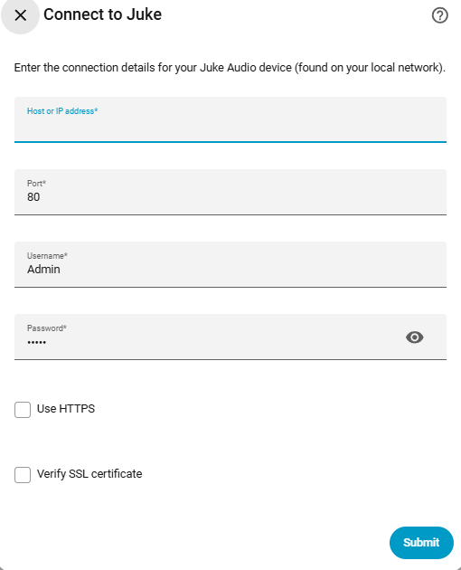
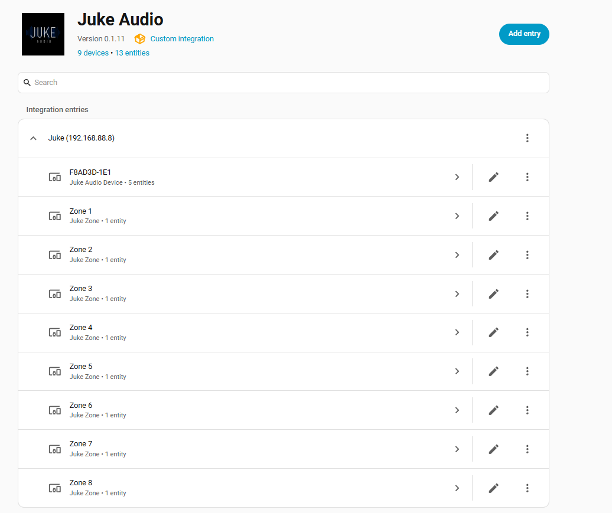
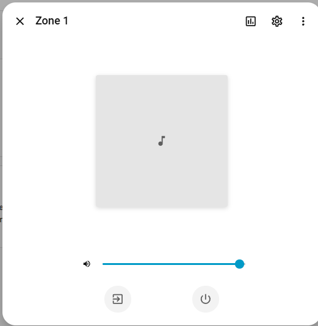
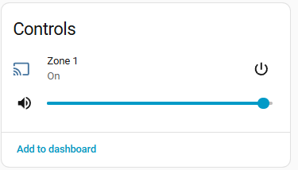

<div align="center">


# Juke Audio for Home Assistant

Control your [Juke Audio](https://jukeaudio.com) whole-home audio system from Home Assistant —
zones as media players, device health as sensors, and input state for automations.

[![hacs][hacs-shield]][hacs-url]
[![version][version-shield]][releases-url]
[![license][license-shield]][license-url]
[![Home Assistant][ha-shield]][ha-url]
[![Validate][validate-shield]][validate-url]
[![Lint][lint-shield]][lint-url]

</div>

---

## Screenshots

<table>
<tr>
<td width="46%" valign="top">

**Setup**



</td>
<td width="54%" valign="top">

**Entities at a glance**

Each zone shows up as its own device (`Zone 1`–`Zone 8` here), alongside the physical
Juke box's diagnostic entities.



</td>
</tr>
</table>

<table>
<tr>
<td width="46%" valign="top">

**Zone media player**



</td>
<td width="54%" valign="top">

**Lovelace control card**



</td>
</tr>
</table>

## Features

| Juke concept | Home Assistant platform | What you get |
|---|---|---|
| Zone (physical audio output) | `media_player` | Volume, mute, on/off, source select (active input) |
| Input (General / Restricted General class) | `media_player` | Volume where supported (USB/RCA/Optical), on/off (enable/disable), source select (input type — General class only) |
| Device (a physical Juke box) | `sensor` | CPU usage, RAM usage, disk usage, internal temperature |
| Device | `sensor` | One "Streaming inputs" summary sensor per device, count of inputs currently streaming, with a per-input streaming/enabled breakdown in its attributes |
| Device | `button` | Reboot (tagged as a restart/diagnostic control) |

Each input (General or Restricted General class) gets its own `media_player` entity and
device, alongside the existing "Streaming inputs" summary sensor — the summary stays
around for quick automations/templates, the per-input entities are there when you want
to see or control one directly. Zone-based Spotify/AirPlay2 pseudo-inputs (they're
tightly coupled to whichever zone they belong to) don't get their own entity, since
there's nothing independently useful to control on them.

State is polled every 30 seconds — the Juke API doesn't offer a push/websocket
transport, only outbound webhook subscriptions, which this integration doesn't use.

Deliberately **not** exposed: streaming-service credentials and noise threshold. Those
are one-time setup values with no automation upside, and credentials in particular
shouldn't become HA entities — manage those in the Juke app. Input type *is* exposed
(as `source`/`select_source` on the input's `media_player` entity) for General-class
inputs, since the API allows changing it and it's a reasonable thing to automate.

## Installation

### HACS (custom repository)

1. HACS → Integrations → the **⋮** menu → **Custom repositories**.
2. Add this repository's URL, category **Integration**.
3. Install **Juke Audio**, then restart Home Assistant.

### Manual

1. Copy `custom_components/juke` into your Home Assistant `config/custom_components/`
   directory.
2. Restart Home Assistant.

## Configuration

### Auto-discovery

Juke boxes advertise themselves on the local network as `jukeaudio.local` (visible in
their AirPlay/`_raop._tcp` mDNS record) — the same hostname string a router sees in the
device's DHCP request. This integration registers a `dhcp` matcher on `jukeaudio*`, so
if Home Assistant's built-in DHCP discovery sees a Juke box on your network, it'll show
up as a **Discovered** card under Settings → Devices & Services with the host pre-filled
— you just confirm the credentials.

(`_raop._tcp` itself wasn't used for discovery since it's the generic AirPlay/Shairport
Sync service type shared by every AirPlay receiver on the market, not something unique
to Juke — hostname-based DHCP matching is the more reliable signal here.)

If nothing is auto-discovered (some routers/network setups don't propagate DHCP
hostnames the way HA's discovery expects), manual setup below always works.

### Manual setup

Settings → Devices & Services → **Add Integration** → search **Juke**.

| Field | Notes |
|---|---|
| Host or IP address | Your Juke device's address on your local network |
| Port | Default `80` |
| Username / Password | HTTP Basic Auth. Ships as `Admin` / `Admin` — change this in the Juke app if you haven't, since it controls your whole audio system |
| Use HTTPS / Verify SSL certificate | Leave off unless your device is configured for TLS |

The config flow checks connectivity (`GET /ping`) and validates credentials
(`GET /zones/info`) before the entry is created, so setup fails fast with a clear
error instead of creating a broken integration.

## Entity reference

<details>
<summary><strong>media_player — one per zone</strong></summary>

| Attribute / service | Behavior |
|---|---|
| `state` | `on` / `off`, mapped from the zone's enabled flag |
| `volume_level` | 0.0–1.0, mapped from Juke's 0–100 |
| `is_volume_muted` | Zone mute state |
| `source` / `source_list` | Friendly input name, from the inputs assigned to that zone |
| `media_player.turn_on` / `turn_off` | Enables/disables the zone |
| `media_player.volume_set`, `volume_mute`, `select_source` | As you'd expect |
| Extra attributes | `mono`, `volume_eq`, `sampling_rate`, `warnings` |

No transport controls (play/pause/track) — the Juke API doesn't expose playback
state, only output-level controls.

</details>

<details>
<summary><strong>media_player — one per input (General / Restricted General class)</strong></summary>

| Attribute / service | Behavior |
|---|---|
| `state` | `on` / `off`, mapped from the input's enabled flag |
| `volume_level` | 0.0–1.0, mapped from Juke's 0–100 — only present for USB/RCA/Optical inputs; volume control is omitted entirely for inputs where the API reports no volume |
| `source` / `source_list` | The input's type / its available types — `select_source` only offered for General-class inputs, since the API rejects type changes on Restricted General ones |
| `media_player.turn_on` / `turn_off` | Enables/disables the input |
| `media_player.volume_set`, `select_source` | As you'd expect, where supported |
| Extra attributes | `input_class`, `streaming`, `zones` (the zone ids this input is currently mapped to) |

Zone-based Spotify/AirPlay2 pseudo-inputs are skipped — see [Features](#features) above.

</details>

<details>
<summary><strong>sensor — five per device</strong></summary>

`cpu_usage`, `ram_usage`, `disk_usage` (all `%`), `internal_temp` (`°C`), and
**Streaming inputs** — all diagnostic-category, grouped under the device's entry in
the device registry along with its serial number and firmware version.

Streaming inputs' `state` is the count of inputs currently streaming; its attributes
carry the full breakdown, one entry per input:

```yaml
Spotify:
  streaming: true
  enabled: true
AirPlay 2:
  streaming: false
  enabled: true
Optical:
  streaming: false
  enabled: false
```

Reference it in templates/automations as
`state_attr('sensor.juke_device_streaming_inputs', 'Spotify')`.

</details>

<details>
<summary><strong>button — one per device</strong></summary>

**Reboot** — calls `POST /devices/{id}/reboot`. Restart-class, diagnostic entity —
rebooting drops audio on every zone that device serves, so it's kept out of the main
entity list to avoid accidental triggers.

</details>

## Automation ideas

```yaml
# Turn on the living room lights when Spotify starts streaming
automation:
  - alias: "Music on -> lights on"
    trigger:
      - platform: template
        value_template: >
          {{ state_attr('sensor.juke_device_streaming_inputs', 'Spotify').streaming }}
    action:
      - service: light.turn_on
        target:
          entity_id: light.living_room

# Turn off zones overnight instead of leaving them idle and drawing power
automation:
  - alias: "Quiet hours: turn off zones"
    trigger:
      - platform: time
        at: "23:00:00"
    action:
      - service: media_player.turn_off
        target:
          entity_id:
            - media_player.living_room
            - media_player.patio

# Notify if an input that should be enabled ever gets disabled
automation:
  - alias: "Spotify input got disabled unexpectedly"
    trigger:
      - platform: template
        value_template: >
          {{ not state_attr('sensor.juke_device_streaming_inputs', 'Spotify').enabled }}
    action:
      - service: notify.mobile_app_your_phone
        data:
          message: "The Spotify input on Juke was disabled."

# Reboot a device automatically if it overheats
automation:
  - alias: "Juke device overheating -> reboot"
    trigger:
      - platform: numeric_state
        entity_id: sensor.juke_device_internal_temp
        above: 70
    action:
      - service: button.press
        target:
          entity_id: button.juke_device_reboot
```

## Limitations

- No playback/transport state (no play/pause, no track metadata) — a zone is an
  audio *output*, not a music player, in the Juke data model.
- Polling only, every 30 seconds; not real-time.
- Built directly from the published API docs
  (`https://sim.jukeaudio.com/api/v3/apidocs/`), not against every firmware revision
  in the field. If your device's responses differ, it's usually a small, localized fix
  in `api.py` or `coordinator.py` — issues and PRs welcome.

## File layout

```
custom_components/juke/
├── __init__.py            # entry setup/unload, forwards to platforms
├── api.py                  # async REST client (zones/devices/inputs, basic auth)
├── config_flow.py           # UI config flow (host/port/credentials)
├── const.py                 # domain, defaults, update interval
├── coordinator.py            # DataUpdateCoordinator polling zones+devices+inputs
├── media_player.py           # zone -> media_player entities
├── sensor.py                  # device -> diagnostic sensors + input streaming summary
├── button.py                   # device -> reboot button entity
├── manifest.json
├── strings.json
├── translations/en.json
├── icon.png / icon@2x.png        # 256x256 / 512x512 brand icon
└── logo.png / logo@2x.png         # 256x256 / 512x512 brand logo (wordmark)

.github/
├── workflows/
│   ├── validate.yml    # hassfest + HACS validation, on push/PR/nightly
│   └── lint.yml         # ruff check + format check, py_compile, JSON validation
├── ISSUE_TEMPLATE/
│   ├── bug_report.yml
│   ├── feature_request.yml
│   └── config.yml       # disables blank issues, forces a template
└── pull_request_template.md
```

## CI

Every push and PR runs two workflows: **Validate** (hassfest's structural checks on
`manifest.json`/`strings.json`/etc., plus HACS's own repository validation) and
**Lint** (`ruff check` + `ruff format --check` against `custom_components/juke`,
a Python syntax compile, and JSON validation). Validate also runs nightly, since
hassfest/HACS rule updates can flag a previously-passing repo without any code
change on this end.

## Contributing

Issues and PRs welcome — especially reports of any place a device's actual API
responses diverge from what's implemented here. Opening an issue uses one of the
bug report / feature request templates (blank issues are disabled so there's always
enough context to act on). Before opening a PR, run `ruff check custom_components/juke`
and `ruff format custom_components/juke` locally — the same checks run in CI.

## License

[MIT](LICENSE)

[hacs-shield]: https://img.shields.io/badge/HACS-Custom-41BDF5.svg
[hacs-url]: https://hacs.xyz
[version-shield]: https://img.shields.io/badge/version-0.1.23-3b6fe0.svg
[releases-url]: ../../releases
[license-shield]: https://img.shields.io/badge/license-MIT-9aa1ac.svg
[license-url]: LICENSE
[ha-shield]: https://img.shields.io/badge/Home%20Assistant-2024.1%2B-41BDF5.svg
[ha-url]: https://www.home-assistant.io
[validate-shield]: ../../actions/workflows/validate.yml/badge.svg
[validate-url]: ../../actions/workflows/validate.yml
[lint-shield]: ../../actions/workflows/lint.yml/badge.svg
[lint-url]: ../../actions/workflows/lint.yml
